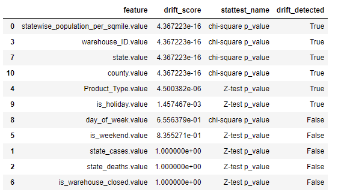
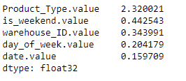
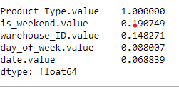
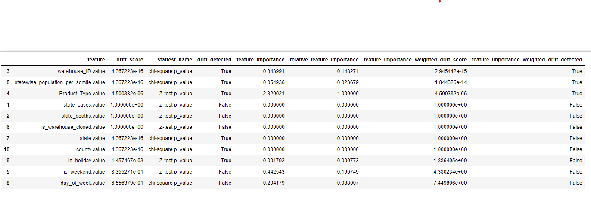
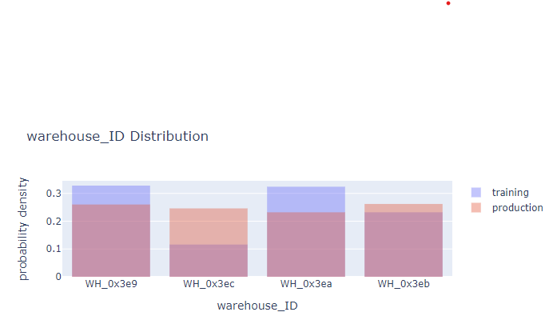
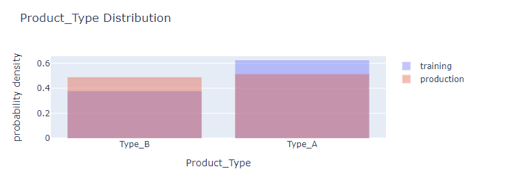
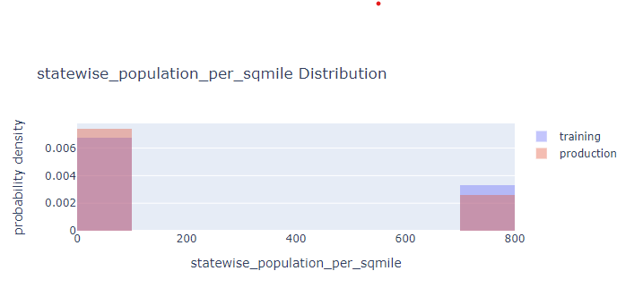
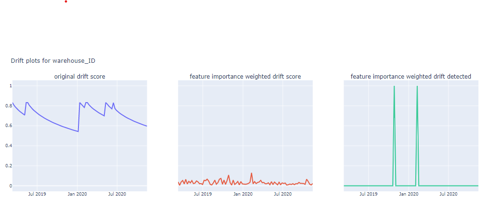
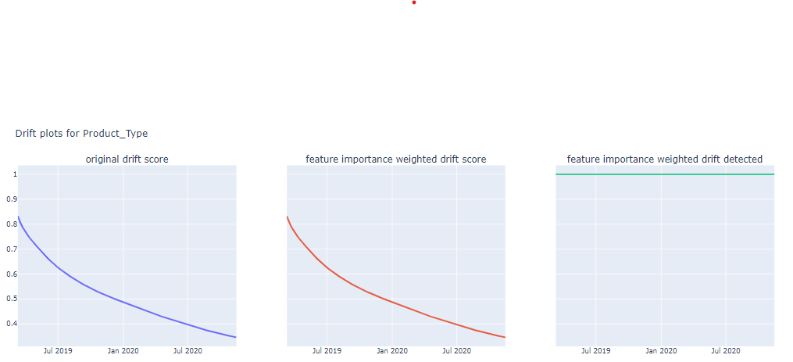
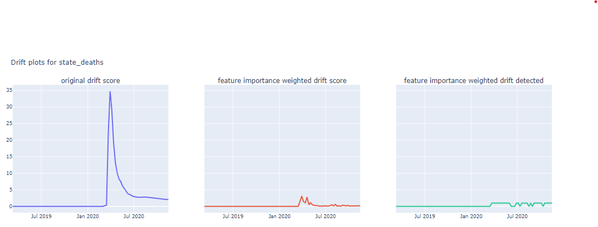

# ML Monitoring - Feature importance weighted drift detection and automated-retraining

## Overview

Every model over time is impacted by model performance decay due to data drift and concept drift. One of many solutions is to perform drift detection and set up automated retraining of the model. Drift in every feature doesn't have the same impact on model performance. In this project, we combine the feature importance of a particular feature with its drift score obtained through a statistical test to determine whether to retrain the model or not. Thus, the model will be retrained only when there is drift on features with higher importance and when features with lower importance face higher data drift.

## Dataset:

* Contains warehouse demand data from 2017-01-01 to 2020-11-15

## Assumptions

* Initial model deployment on march 2019
* True labels/ actual demand available over the weekend
* Model monitored on weekly basis

## How feature importance weighted data drift is calculated?

### get drift scores provided train and production data

drift detected without feature importance wightage for these features - statewise_population_per_sqmile.value, warehouse_ID.value, Product_Type.value, state.value, county.value(5 features)	

### Obtain feature importance

### Convert raw feature importance to relative feature importance based on the most important feature for the model

### Calculate feature importance weighted drift score by combining relative feature importance with drift score. Based on the p-value, obtain updated drift detected columns.

drift detected with feature importance wightage for these features - statewise_population_per_sqmile.value, warehouse_ID.value, Product_Type.value(3 features) 	
<b>state.value and county.value are not detected because of high feature importance weighted p_value.</b>

### Distribution density comparision for drift detected features

### Monthly drift detection simulation from Mar 2019 to Nov 2020
#### Drift in warehouse ID

#### Drift in Product Type

#### Drift in covid cases per state

### Improvements

* Logic to incorporate the severity of drift can be added. Low, medium, and high drift for example
* Selection of train sample duration for the statistical test requires further analysis. Currently, the whole training dataset is being used, which may not be the optimum duration of sample selection. Some of the sample selection logic are:
    * Recent few months of data the model is trained on.
    * Use previously trained data from the same time frame. Example. Compare march 2022 production data with march 2021 data production data. This does not consider changes that might have happened due to model behaviourbehaviorMarch 2021 and March 2022. Alternatively, select samples from march 2021 to Feb 2022 instead of 1 month.
